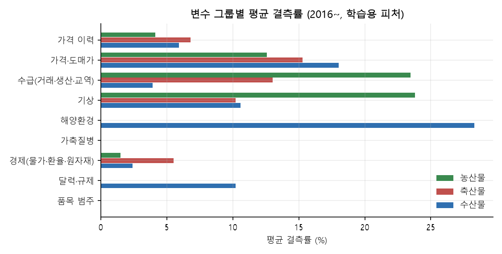
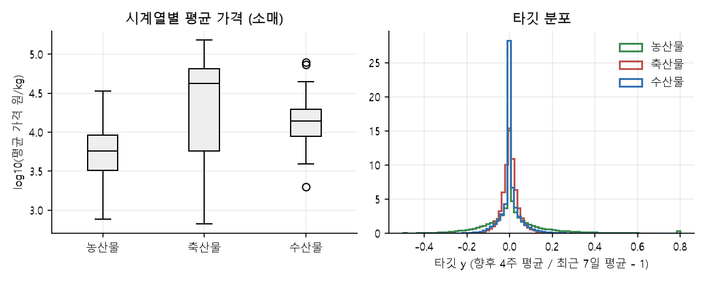
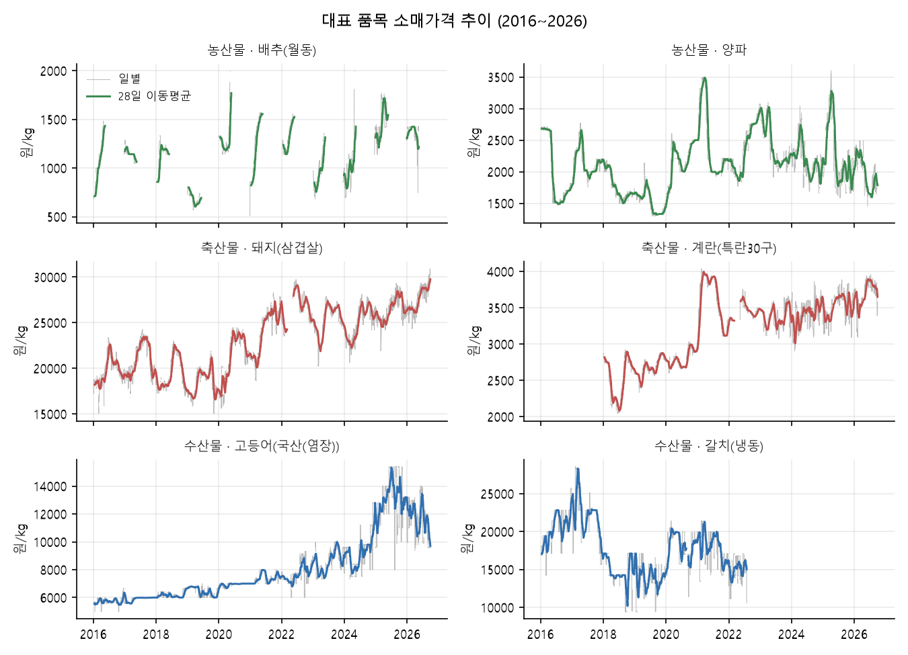
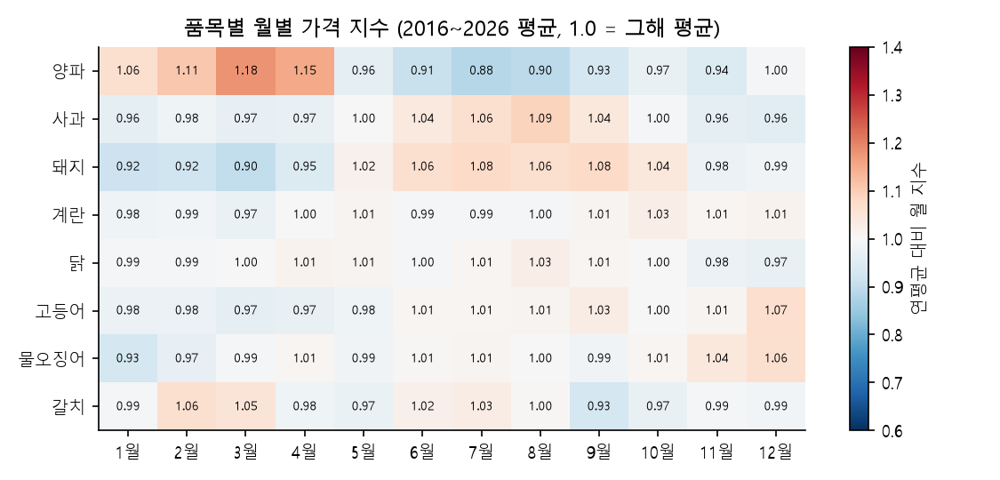
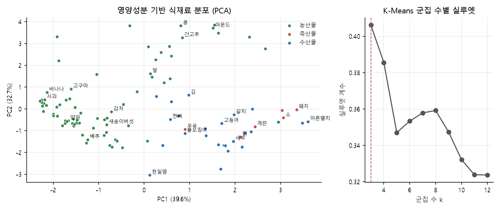

# 식재료 가격 전망 및 유사 식재료 추천 서비스 — 1차 분석 보고서

조원: 경영정보학과 60250770 전준태, 경영정보학과 60250762 원기연

깃허브: https://github.com/joon6644/ML_26_2

---

# 비즈니스 문제

## 1. 배경

본 프로젝트는 팀원들이 직접 자취를 하고 장을 보는 과정에서 경험한 **일상적인 식재료 구매의 불편함**에서 출발하였다.

자취를 하다 보면 필요한 식재료를 직접 구매하게 되는데, 장을 볼 때 단순히 가격을 확인하는 것만으로는 구매 여부를 판단하기 어려운 경우가 많았다. 예를 들어 평소에 구매하던 식재료의 가격이 갑자기 올라갔을 때 **"현재 가격이 과거 대비 어느 수준인지"**, **"향후 더 비싸질 것인지 저렴해질 것인지"**, **"비슷한 식재료는 무엇이 있는지"** 와 같은 의문이 생겼다.

하지만 실제 장보기 과정에서는 이를 직접 확인할 방법 없이 현재 가격만 확인하고 구매하거나, 여러 식재료를 직접 찾아가면서 가격을 비교해야 했다. 특히 특정 식재료의 가격이 부담스러울 정도로 상승했을 때 이를 대신할 만한 **비슷한 식재료를 찾는 과정은 더욱 번거로웠다.**

동시에 프로젝트를 준비하며 개인 소비자인 우리의 고민이 소규모 영업을 하는 자영업자들에게는 더 크게 다가올 수 있을 것이라는 생각으로 이어졌다.

이러한 경험을 통해 단순히

> **"현재 식재료 가격이 얼마인가?"**

와 같은 1차원적 사실만으로는 실제 구매 의사결정에 충분하지 않다는 문제의식을 갖게 되었다.

우리는 식재료 가격을 **과거·현재·미래의 관점에서 함께 확인하고**, 가격이 높아졌을 때는 **비슷한 특성을 가진 상대적으로 저렴한 식재료 후보까지 확인할 수 있다면 실제 장보기 과정에서 더 유용하게 사용할 수 있을 것**이라고 판단하였다.

따라서 본 프로젝트는 가격 데이터를 단순 조회하는 것을 넘어 **가격의 과거·미래와 유사 식재료의 가격 정보를 통합하여 구매 의사결정을 지원하는 서비스**를 구축하는 것을 목표로 한다.

## 2. 비즈니스 문제 정의

#### **"식재료를 구매하는 사용자가 과거 대비 현재 가격의 수준과 향후 가격 변동 가능성을 판단하고, 가격 상승 시 활용할 수 있는 유사 식재료 후보를 한 번에 확인하기 어렵다."**

사용자 입장에서 식재료 구매 과정은 다음과 같은 흐름으로 볼 수 있다.

```
식재료가 필요함
      ↓
현재 가격 확인
      ↓
최근 가격 추세 확인
      ↓
현재 가격 수준 판단
      ↓
향후 가격 변동 예측
      ↓
예상 변동 가격 기반 1차 구매 결정
      ↓
대체 후보의 가격 및 유사성 비교
      ↓
최종 구매 결정
```

하지만 현재 가격 정보만으로는 이러한 흐름의 구체화가 불가능하다. 때문에 실제 구매 상황에서는 현재 가격 정보를 넘어서 더욱 구체화된 정보들이 필요하다.

결국 본 프로젝트가 해결하고자 하는 핵심은 **가격 조회 및 비교 → 전망 → 대체 후보 탐색을 하나의 흐름으로 연결해 사용자 의사결정**에 도움이 되는 것이다.

## 2.1 문제 분해 및 구체화

비즈니스 문제를 크게 세 가지 문제로 분해한다.

#### 문제 A. 가격 수준을 이해하기 어렵다

현재 가격만 보면 가격이 높은지 낮은지를 판단하기 어렵다. 예를 들어 동일한 5,000원의 가격이라도 계절적 특성에 따라 평소보다 높은 가격일 수도 있고 낮은 가격일 수도 있다. 따라서 다음과 같은 비교 기준이 필요하다.

- 최근 평균 대비 가격
- 최근 1년 가격 분포에서의 위치
- 최근 가격 변동률

#### 문제 B. 미래 가격 변동을 알기 어렵다

현재 가격이 높아 보이더라도 향후 가격이 지속적으로 상승할 가능성이 있다면 구매 전략이 달라질 수 있다. 반대로 현재 가격이 낮아 보이는데 향후 하락 가능성이 높을 때도 사용자에게 의미 있는 정보가 될 수 있다. 따라서 과거 가격과 외부 변수를 활용한 **가격 예측 모델**이 필요하다.

#### 문제 C. 가격 상승 시 대체 후보를 찾기 어렵다

특정 식재료의 가격이 상승했을 때 사용자가 직접 유사 식재료를 검색하는 것은 번거롭다. 또한 단순 가격만으로 대체재를 선택하면 요리 용도나 특성이 크게 다른 식재료가 선택될 수 있다. 따라서 **식재료 특성 → 유사 식재료 탐색 → 유사도 계산 → 가격 비교 → 저렴한 후보 필터링** 구조가 필요하다.

## 3. 타겟층 및 핵심 니즈

#### 주요 타겟층

- 개인 소비자
- 소상공인 및 자영업자

문제 정의의 시작점인 자취생이나 1인 가구와 같은 개인 소비자들은 제한된 예산 안에서 장을 보기 때문에 식재료 가격 변동을 체감하기 쉽고, 필요한 식재료가 비싸졌을 경우 다른 식재료를 선택해야 하는 상황이 쉽게 발생해 **큰 부담과 번거로움**을 느낀다.

동시에 소상공인 및 자영업자들은 개인 소비자에 비해 구입하는 식재료의 절대적 양이 많기 때문에 식재료 가격 수준 변화에 더 큰 영향을 받을 수 있다. 때문에 해당 프로젝트의 주요 타겟층은 **개인 소비자와 소상공인 및 자영업자**로 설정한다.

#### 타겟층 니즈

| 사용자 니즈 | 필요한 데이터 |
| --- | --- |
| 현재 가격 확인 | 최신 식재료 가격 |
| 가격 추세 파악 | 과거 가격 그래프 |
| 현재 가격 수준 판단 | 최근 평균, 과거 동일 시기, 가격 분포 |
| 향후 구매 판단 | 미래 가격 전망 (예측 모델) |
| 가격 상승 대응 | 유사 식재료 |
| 대체 후보 선택 | 유사도 + 식재료들의 현재 가격 |
| 구매 의사결정 | 위 정보를 통합한 비교 정보로 직접 결정 |

최종적으로 산출할 서비스의 핵심은 특정 상품을 대신 선택해주는 것이 아니라 **사용자가 판단할 수 있는 근거를 제공하는 것**이다.

---

# 가설

## 1. 식재료 가격에는 일정한 시간적 패턴이 존재한다.

식재료는 1년간 계절과 이에 따른 기후, 제철 유무에 따라 주기적으로 가격이 변동한다. 즉 식재료의 과거 가격 데이터에는 추세, 계절성, 주기성 등 **반복적인 패턴이 존재**할 것이며, 이러한 패턴을 활용하면 단순 현재 가격을 넘어 미래 가격을 일정 수준 이상 설명할 수 있다.

- 검증 방법: 월별 가격 지수와 연도 간 반복성, 자기상관 (EDA ③~⑤)

## 2. 식재료별로 가격 변동 특성이 다르다.

농산물, 축산물, 수산물은 **가격 형성 구조가 다르며 영향을 받는 변수 범위도 상이**하다. 때문에 동일한 변수와 동일한 모델을 적용했을 때 성능 차이가 발생할 것이고, 이를 극복하는 것이 해결할 과제이다.

- 검증 방법: 분야별 가격 수준·변동성·계절성·자기상관 비교 (EDA ⑦)

## 3. 외부 변수를 활용하면 가격 예측 성능을 개선할 수 있다.

과거 가격만 사용하는 모델보다 기후, 생산량, 유가, 환율 등의 **외부 변수를 함께 사용**하는 모델의 예측 성능이 더 높을 것이다.

- 검증 방법: 모델링 단계에서 같은 모델로 "가격 정보만" vs "+ 외부 변수"를 비교

## 4. 식재료는 가격 외 특성을 이용해 유사 그룹을 구성할 수 있다.

식재료는 각각 농산, 축산, 수산 분류는 물론 상이한 특성과 계열, 영양소 등을 지닌다. 따라서 **영양성분, 식재료 계열, 분류, 조리·사용 특성 등을 활용**하면 단순 가격 기반보다 의미 있는 유사 식재료 그룹을 생성할 수 있다.

- 검증 방법: 영양성분 기반 PCA·K-Means 군집 (EDA ⑧)

## 5. 유사도와 가격을 함께 사용하면 대체 후보 탐색에 활용할 수 있다.

같은 군집 안에서 가격만 기준으로 저렴한 식재료를 찾는 것보다 **유사도와 가격을 함께 고려**해 더 가성비 있는 후보를 추천해주는 것이 사용자에게 더 의미 있는 후보를 제공할 수 있다.

- 검증 방법: 추천 로직 구현 후 KPI 2·3으로 확인

## 6. 상대적인 가격 정보가 단순한 "비싸다/싸다" 판단 대비 더욱 유용하다.

현재 가격 자체보다 최근 평균 대비, 전년 동일 기간 대비, 최근 1년 가격 분포 대비, 미래 가격 전망 등의 상대적 정보가 가격 수준을 해석하는 데 더 적합하다. 따라서 서비스에서는 "비쌈/보통/쌈"과 같은 단순 가격 판단 정보를 핵심 정보로 사용하기보다 **수치와 비교 기준을 함께 제공하는 방식**을 제공한다.

---

# KPI

## 1. KPI 설계

KPI는 **서비스 KPI / 모델 KPI** 로 구분한다. 실제 배포 가능성과 관련해 클릭률, 방문 등은 실질적으로 알기 어렵기 때문에 제외하고 결정한다.

## 1.1 서비스 KPI

#### KPI 1. 식재료 검색 성공률

사용자가 식재료를 검색한 후 가격 정보 또는 전망 정보를 정상적으로 확인할 수 있는 비율.

#### KPI 2. 대체 후보 제공률

```
대체 후보 제공률
= 추천 후보가 1개 이상 존재하는 식재료 수
÷ 전체 분석 대상 식재료 수
```

#### KPI 3. 후보 다양성

- 평균 추천 후보 수
- 유사도 최소 조건을 만족하는 후보 수
- 가격 조건을 만족하는 후보 수

## 1.2 모델 KPI

#### KPI 4. 모델 성능 지표

회귀 모델에 맞는 지표로 **RMSE, MAE, R²** 를 사용한다.

설명력 지표인 R²를 단순 비교하는 것이 아니라, 큰 오차에 더 큰 페널티를 주는 **RMSE를 메인 KPI**로 설정한다. 즉 **Baseline 대비 RMSE를 얼마나 개선했는가**를 메인 KPI로 한다.

Baseline은 **"오늘 가격 = 향후 4주 평균 가격"**, 즉 직전 가격이 유지된다고 보는 예측으로 한다. 가격 수준의 자기상관이 매우 높아(EDA ⑤) 단순하지만 넘어서기 쉽지 않은 기준이다.

MAE는 이상치에 덜 민감한 평균 오차로, R²는 타깃의 변동을 얼마나 설명하는지로 보조적으로 사용한다. 동시에 데이터 결측률과 중복률, 이상치 등을 함께 고려하며 진행한다.

---

# 데이터

식재료들의 **가격 변동 데이터 및 외부 변수**는 물론 **군집화와 대체재 추천 프로세스를 위한 영양성분 데이터**를 확보하기 위해 KAMIS(aT), MAFRA, 축산물품질평가원, 기상청, 국립수산과학원, KOSIS, 한국은행 ECOS, 식약처 등 공공 포털의 API와 파일을 수집하고, 전처리 후 분야(농·축·수산)별로 조인해 학습용 데이터를 생성하였다.

- 학습·분석 기간은 **2016년 이후 약 10년**이다. 2015년 데이터는 전년 대비 등 가격 이력 계산을 위한 준비 기간으로만 사용한다.
- 월·분기·연 단위 통계는 **실제 공개일 기준**으로 붙였다 (예: 관세청 수출입 = 월말 + 20일, 가축동향 = 분기말 + 60일, 농작물 생산량 = 다음 해 3월). 예측 시점에 알 수 없었던 값이 학습에 들어가는 미래 정보 누수를 막기 위함이다.
- 가격 단위는 모두 **원/kg**으로 환산하였다 (개·포기·마리 등은 KAMIS 표준 중량으로 환산).

## 데이터 출처

| 출처 | 데이터 | 주요 항목 | 사용 변수 |
| --- | --- | --- | --- |
| **KAMIS (aT)** | 농·축·수산물 소매·중도매 가격 (일) | 날짜, 품목, 품종, 등급, 가격 | 타깃, price_kg, whsl_price_kg, 가격 이력 |
| aT | 가락시장 정산 거래 (일) | 품목, 물량, 금액, 원산지 | garak_* |
| **MAFRA** | 농수축산물 전국 도매시장 가격 (일) | 품목, 도매시장, 가격 | mafra_whsl_price_kg |
| MAFRA | 가축질병 발생정보 | 발생일, 질병명, 축종, 두수 | disease_* |
| **축산물품질평가원** | 축산물 소비자가격 (일) | 부위, 등급, 가격 | 2016~2017 소·돼지 가격 보완 |
| 축산물품질평가원 | 소·돼지 경락가격, 돈육 대표가격 | 경락단가, 경락 두수 | auction_*, pig_auction_* |
| 축산물품질평가원 | 축산물 재고동향 (월) | 축종, 재고량 | stock_ton |
| **관세청** | 품목별 수출입실적 (월) | HS코드, 중량, 금액 | import_*, export_kg |
| **기상청** | ASOS 일자료 (97개 관측소) | 기온, 강수, 일조, 일사, 습도, 풍속, 적설 | wx_*, prodarea_* |
| 기상청 | 해양기상부이 (17개소, 시간자료) | 수온, 풍속 | sea_temp_*, buoy_* |
| **국립수산과학원** | 연안정지관측, 어장환경관측 | 수온, 염분, 용존산소 등 | coast_temp_*, farm_*, farmitem_* |
| 국립수산과학원 | 적조 / 해파리 | 발생일, 해역, 밀도 / 주간 보고 | redtide_*, jellyfish_reports |
| 해양수산부 | 금어기 고시 (수산자원관리법) | 어종별 금어기 | closed_* |
| **KOSIS** | 가축동향조사 (분기) | 농장 수, 사육 두수 | census_* |
| KOSIS | 농작물생산조사 (연) | 재배면적, 생산량 | production_ton, cultivated_area_ha |
| KOSIS | 어업생산동향 (월) | 생산량, 생산금액 | catch_* |
| KOSIS | 석유제품 가격 (월) | 휘발유, 경유, 등유 | fuel_* |
| **한국은행 ECOS** | 환율 (일), 소비자물가지수·수입물가지수·국제원자재가격 (월) | 지수, 가격 | usd_krw, cpi_*, impidx_*, intl_* |
| Python holidays 패키지 | 한국 공휴일 | 공휴일, 설·추석 | is_holiday |
| **식약처** (파일) | 원재료 영양성분 (3,704건) | 에너지, 단백질, 지방, 탄수화물 등 | 식재료 군집 (EDA ⑧) |

수집했으나 이번 분석에는 사용하지 않은 데이터: 국립수산과학원 실시간 해양관측(기간 부족), 오피넷 유가(최근 7일만 제공), KOSIS 농산물 생산비, MAFRA 채소류 생산실적(2013~2016), 수협 위판장 정보(가격·물량 없음), 식약처 음식 영양성분·MAFRA 레시피(대체재 추천 2차 분석용).

## 타깃

최근 일주일 가격에 비해 **향후 4주의 평균 가격이 어떻게 되는지**를 예측한다.

하루하루 가격은 값이 튈 수 있어 불안정하고, 회귀로 특정일 가격을 정확하게 맞추는 것은 어려우며, 소비자 입장에서는 앞으로의 추세를 기반으로 의사결정하는 것이 일반적이기 때문이다. 4주(28일)는 요일 구성이 고르게 들어가는 기간이라 30일보다 비교가 안정적이다. 가격 자체가 아니라 **변화율**을 예측하므로 1,000원/kg 채소와 100,000원/kg 한우를 하나의 모델로 학습할 수 있다.

| 이름 | 뜻 |
| --- | --- |
| `y` | `(향후 28일 평균 가격 / 최근 7일 평균 가격) − 1` (0.05 = 5% 상승) |

예측 가격은 `최근 7일 평균 × (1 + ŷ)`으로 되돌려 서비스에 표시한다.

## 피처

수집한 원본 변수(농산 99, 축산 95, 수산 119개)를 **도메인 지식으로 1차 정리**하였다.

- 해당 분야와 무관한 국제원자재(금속·석탄·원면 등)·수입물가지수 제거. 월별 지표는 같은 달이면 모든 품목에 같은 값이라, 관련이 없어도 모델이 시기를 구분하는 표식으로 쓸 위험이 있다.
- 품목마다 고정값인 영양성분(품목코드와 중복), 주차와 중복되는 월, 값이 항상 0인 변수 제거.
- 가격 이력 8개와 주차는 학습 시 가격으로부터 계산한다.

**공통 (38개)**

| 구분 | 변수 |
| --- | --- |
| 키·범주 | item_cd (품목코드), food_group (식재료 계열), se_nm (소매/중도매) |
| 가격 | price_kg (오늘 가격 원/kg) |
| 가격 이력 | r7 (1주 변화율), r28 (4주 변화율), r91 (13주 변화율), yoy (전년 대비), vol28 (28일 변동성), dev_last (오늘 가격 / 7일 평균), ly_change (작년 같은 시기 변화율), n_obs28 (28일 조사일 수) |
| 달력 | woy (주차), dow (요일) |
| 기상 (전국) | wx_temp_avg (평균기온), wx_temp_max (최고기온), wx_temp_min (최저기온), wx_rain (강수량), wx_rain_1h_max (1시간 최대강수), wx_snow_depth (적설), wx_humidity (습도), wx_wind_avg (평균풍속), wx_wind_gust (최대순간풍속), wx_sunshine_hr (일조시간), wx_solar_rad (일사량), wx_ground_temp (지면온도) |
| 경제 | usd_krw (원/달러 환율), cpi_총지수 (소비자물가 총지수), cpi_식료품 (식료품 물가), cpi_item (품목 소비자물가), intl_원유_Brent (브렌트유), intl_천연가스 (천연가스), fuel_보통휘발유 (휘발유), fuel_자동차용_경유 (경유), fuel_실내등유 (등유) |
| 교역 | import_kg (수입량), import_usd (수입액), export_kg (수출량) |

**농산물 (공통 + 29개 = 67개)**

| 구분 | 변수 |
| --- | --- |
| 도매가 | whsl_price_kg (aT 중도매가), mafra_whsl_price_kg (도매시장 가격) |
| 가락시장 | garak_qty_kg (반입 물량), garak_price_kg (정산가), garak_amount_krw (정산 금액), garak_n_trades (정산 건수), garak_top_origin_share (주산지 반입 비중) |
| 주산지 기상 | prodarea_temp_avg (평균기온), prodarea_temp_max (최고기온), prodarea_temp_min (최저기온), prodarea_rain (강수량), prodarea_sunshine_hr (일조시간), prodarea_humidity (습도), prodarea_wind_avg (풍속) |
| 생산 | production_ton (생산량), cultivated_area_ha (재배면적) |
| 국제곡물 | intl_소맥 (밀), intl_옥수수 (옥수수), intl_대두 (대두) |
| 수입물가 | impidx_농산물, impidx_곡류, impidx_곡물및식량작물, impidx_맥류및잡곡, impidx_콩류, impidx_과일, impidx_채소및과실, impidx_과실및채소가공품, impidx_기타식용작물, impidx_유지 (각 품목군 수입물가지수) |

**축산물 (공통 + 22개 = 60개)**

| 구분 | 변수 |
| --- | --- |
| 달력 | is_holiday (공휴일) |
| 가축질병 | disease_cases (품목 관련 질병 건수), disease_heads (품목 관련 질병 두수), disease_all_cases (전체 가축전염병 건수), disease_all_heads (전체 가축전염병 두수) |
| 사육 | census_heads (사육 두수), census_farms (사육 농가 수) |
| 경락 | auction_heads (소·돼지 경락 두수), auction_price_kg (소·돼지 경락가), pig_auction_price_kg (돼지 경락가 탕박), pig_auction_skinned_kg (돼지 경락가 박피), pig_auction_rep_kg (돼지 대표가격) |
| 재고 | stock_ton (축산물 재고) |
| 국제곡물 (사료) | intl_소맥 (밀), intl_옥수수 (옥수수), intl_대두 (대두) |
| 수입물가 | impidx_축산물, impidx_도축육, impidx_가금육, impidx_낙농품, impidx_낙농및육류, impidx_육가공품및낙농품 (각 품목군 수입물가지수) |

**수산물 (공통 + 44개 = 82개)**

| 구분 | 변수 |
| --- | --- |
| 도매가 | whsl_price_kg (aT 중도매가), mafra_whsl_price_kg (도매시장 가격) |
| 생산 | catch_ton (어업 생산량), catch_value_kkrw (어업 생산금액) |
| 해역 수온 | sea_temp_east (동해 수온), sea_temp_south (남해 수온), sea_temp_west (서해 수온), buoy_temp_max (부이 최고수온), buoy_wind_avg (부이 풍속), coast_temp_avg (연안 수온), coast_temp_n_stations (연안 관측소 수) |
| 적조·해파리 | redtide_reports (적조 보고 수), redtide_areas (적조 해역 수), redtide_density_max (적조 최대밀도), jellyfish_reports (해파리 출현 보고) |
| 금어기 | closed_season (금어기 여부), closed_window (금어기 가능 기간), days_to_closed_start (금어기까지 남은 일수) |
| 어장환경 (전체) | farm_temp_s (표층수온), farm_temp_b (저층수온), farm_sal_s (표층염분), farm_do_s (표층용존산소), farm_do_b (저층용존산소), farm_cod_s (COD), farm_din_s (용존무기질소), farm_dip_s (용존무기인), farm_chl_s (엽록소), farm_ss_s (부유물질) |
| 어장환경 (품목) | farmitem_temp_s, farmitem_temp_b, farmitem_sal_s, farmitem_do_s, farmitem_do_b, farmitem_cod_s, farmitem_din_s, farmitem_dip_s, farmitem_chl_s, farmitem_ss_s (위와 같은 항목, 해당 품목 양식 어장 기준) |
| 수입물가 | impidx_수산물, impidx_신선수산물, impidx_냉동수산물, impidx_냉동건조수산물, impidx_수산가공품, impidx_수산물가공품 (각 품목군 수입물가지수) |

---

# EDA

EDA는 다음 네 가지 질문에 답하는 것을 목표로 한다. 변수가 많기 때문에 개별 변수가 아니라 **분야별·변수 그룹별**로 요약하고, 시계열은 분야별 대표 품목으로 보여준다.

| 질문 | 해당 분석 |
| --- | --- |
| Q1. 가격 데이터가 실제로 예측 가능한 구조를 가지고 있는가? | ①~⑥ |
| Q2. 농산물·축산물·수산물의 가격 특성이 서로 다른가? | ⑦ |
| Q3. 가격 예측에 활용할 수 있는 변수는 무엇인가? | ⑤ (가격 이력 설계), 데이터·피처 정리. 외부 변수의 효과는 모델링 단계에서 검증 |
| Q4. 유사 식재료 군집을 만들 수 있을 만큼 식재료 간 특성이 구분되는가? | ⑧ |

## ① 데이터 구조 및 품질

1행 = 시계열(품목 × 품종 × 등급 × 소매/중도매) × 가격 조사일이며, 값은 그날 전국 조사 시장 가격의 중앙값(원/kg)이다.

| 분야 | 행 수 | 품목 수 | 시계열 수 | 시계열당 조사일 (중앙값) | 조사 밀도 | 2016년부터 있는 시계열 |
| --- | --- | --- | --- | --- | --- | --- |
| 농산물 | 638,642 | 74 | 449 | 1,237일 | 0.66 | 58% |
| 축산물 | 62,275 | 7 | 36 | 1,679일 | 0.69 | 6% |
| 수산물 | 111,773 | 28 | 96 | 769일 | 0.66 | 30% |

- 기간은 2016-01-04 ~ 2026-09-29, 소매·중도매 가격을 포함한다 (축산물은 소매만).
- **키+날짜 중복 0건, 가격 결측 0건**이다. 조사 밀도 0.66은 주말·공휴일에 조사가 없기 때문이다.
- 품목·품종이 중간에 추가·폐지되어 **모든 시계열이 같은 기간을 갖지는 않는다.** 특히 축산물 소매가격은 KAMIS에서 2018년부터 제공되어, 2016~2017년은 축산물품질평가원 소비자가격으로 소·돼지 2개 부위만 보완하였다. 이 때문에 축산물은 2016~2022년 데이터가 적다.



- 결측은 주로 **제공 기간과 대상 품목의 차이**에서 생긴다. 가락시장 거래(2018년~, 거래 품목만), 주산지 기상(생산 통계가 있는 품목만), 어장환경(양식 품목·조사 월만)이 대표적이다.
- 결측은 **학습셋 평균으로 대체**하고, MinMax 스케일링은 학습셋으로만 맞춘다.

## ② 가격 분포

| 분야 | 소매 시계열 | 평균 가격 중앙값 (원/kg) | 최소 ~ 최대 | 최대/최소 배율 | 변동계수(CV) 중앙값 |
| --- | --- | --- | --- | --- | --- |
| 농산물 | 212 | 5,699 | 770 ~ 33,438 | 43배 | 0.22 |
| 축산물 | 36 | 42,550 | 663 ~ 151,235 | 228배 | 0.10 |
| 수산물 | 69 | 13,958 | 2,011 ~ 78,781 | 39배 | 0.14 |



- 품목 간 가격 수준 차이가 수십~수백 배에 이르므로 **가격 자체가 아니라 변화율을 타깃으로 하는 것이 타당**하다.
- 시계열 내부 변동(CV)은 **농산물이 가장 크고**(0.22) 축산물이 가장 작다(0.10).

| 분야 | 타깃 y 평균 | 표준편차 | 5% ~ 95% | \|y\| > 10% 비율 |
| --- | --- | --- | --- | --- |
| 농산물 | +1.8% | 0.170 | −20.6% ~ +29.8% | 31% |
| 축산물 | +0.3% | 0.052 | −6.6% ~ +7.9% | 5% |
| 수산물 | +0.3% | 0.056 | −8.0% ~ +9.4% | 8% |

- 향후 4주 동안 10% 넘게 움직이는 경우가 **농산물은 3번 중 1번**, 축산·수산물은 5~8%에 불과하다. 축산·수산물은 "거의 변하지 않는" 구간이 대부분이다.

## ③ 가격의 시간적 패턴



- **배추**는 계절별 품종(월동·고랭지 등)이 번갈아 조사되어 시계열이 끊겨 있고, 그 안에서 급등락이 크다.
- **양파**는 수확기(5~7월) 하락, 저장기 말(2~4월) 상승이 반복되며 몇 년에 한 번 큰 폭등이 있다.
- **돼지(삼겹살)**는 해마다 여름에 오르는 패턴과 장기 상승 추세가 함께 보인다.
- **계란**은 2021년 고병원성 AI 시기 급등처럼 질병 이벤트에 따른 수준 이동이 나타난다.
- **수산물**은 계절 패턴보다 장기 추세와 수준 변화가 크다. 고등어는 2022년 이후 가파르게 상승했고, 갈치(냉동)는 2017년 고점 이후 하락·횡보하다 2022년에 조사가 중단되었다.

## ④ 계절성

월별 가격을 그해 평균으로 나눈 **월 지수**로 품목 간 계절 패턴을 비교하였다.

| 분야 | 분석 시계열 | 월 지수 진폭 (중앙값) | 진폭 ≥ 0.3인 시계열 | 연도 간 계절 패턴 상관 |
| --- | --- | --- | --- | --- |
| 농산물 | 110 | 0.30 | 49% | 0.39 |
| 축산물 | 33 | 0.08 | 0% | 0.07 |
| 수산물 | 30 | 0.10 | 7% | 0.08 |

진폭 0.30은 가장 비싼 달과 가장 싼 달이 연평균 대비 30%p 차이 난다는 뜻이다. 연도 간 상관은 해마다 같은 월 패턴이 반복되는 정도이다.



- **농산물은 계절성이 뚜렷하고 해마다 반복된다.** 절반의 시계열이 연중 30%p 이상 움직인다. 배추·무처럼 계절별 품종으로 나뉘어 조사되는 품목은 한 시계열이 열두 달을 다 갖지 않아 그림에서 제외하였다.
- **축산·수산물은 계절 진폭이 10% 내외로 작고, 연도마다 패턴이 다르다.** 예외적으로 돼지는 여름(6~9월) 상승, 겨울~봄 하락이 일관된다.
- **요일 효과는 ±0.6% 이내로 미미**하며 일요일은 대부분 조사가 없다. 따라서 달력 피처는 월 대신 **주차(woy)**를 사용한다.

## ⑤ 추세 및 자기상관

| 분야 | 가격 lag 1일 | lag 7일 | lag 28일 | lag 91일 | 4주 변화 vs 직전 4주 변화 | 4주 변화 vs 1년 전 같은 시기 변화 |
| --- | --- | --- | --- | --- | --- | --- |
| 농산물 | 0.989 | 0.938 | 0.743 | 0.392 | +0.03 | **+0.24** |
| 축산물 | 0.964 | 0.818 | 0.682 | 0.505 | **−0.27** | +0.04 |
| 수산물 | 0.985 | 0.939 | 0.844 | 0.641 | **−0.16** | +0.06 |

수치는 시계열별 상관의 중앙값이다 (log 가격, 일 단위).

- **가격 수준**은 한 달 뒤에도 자기상관이 0.68~0.84로 높다. "오늘 가격 유지"가 강력한 기준선인 이유이며, 모델은 이를 넘어서는 **변화**를 맞혀야 한다.
- **가격 변화**에서는 분야별로 다른 구조가 보인다.
  - **농산물:** 작년 같은 시기의 변화가 반복된다 (+0.24) → 계절 정보(`ly_change`, `yoy`)가 유효하다.
  - **축산·수산물:** 직전에 오른 만큼 되돌아오는 **평균 회귀** 성향이 있다 (−0.27, −0.16) → 최근 변화율(`r7`, `r28`, `dev_last`)이 유효하다.
- 이 결과로 예측 기간(Horizon)을 **4주**로, 가격 이력 피처를 **1주·4주·13주·1년** 단위로 설계하였다.

## ⑥ 이상치 분석

가격 급변을 **데이터 오류 가능성**과 **실제 시장 이벤트**로 구분하였다.

| 분야 | 일간 변화 수 | ±50% 이상 급변 | 비율 | 다음 조사일 원복 (오류 의심) |
| --- | --- | --- | --- | --- |
| 농산물 | 638,193 | 1,045 | 0.16% | 8건 (1%) |
| 축산물 | 62,239 | 51 | 0.08% | 3건 (6%) |
| 수산물 | 111,677 | 70 | 0.06% | 1건 (1%) |

급변은 직전 조사일 대비 ±50% 이상 변한 경우이다. 다음 조사일에 원래 수준(±10%)으로 돌아오면 입력 오류나 일시적 튐으로 의심한다.

- 급변 자체가 매우 드물고, 그중 **94~99%는 다음 날에도 유지되는 실제 수준 변화**(작황 충격, 품종 교체, 질병 등)이다.
- 따라서 이상치를 **제거하지 않는다.** 하루짜리 튐은 타깃을 7일·28일 평균으로 정의해 완화되고, `dev_last`(오늘 가격 / 7일 평균)로 모델이 직접 인지한다.
- 단위 오류는 수집 단계에서 KAMIS 표준 중량으로 원/kg 환산하며 처리하였다.

## ⑦ 농산물·축산물·수산물 비교

| 분석 항목 | 농산물 | 축산물 | 수산물 |
| --- | --- | --- | --- |
| 가격 수준 (원/kg 중앙값) | 5,699 | 42,550 | 13,958 |
| 변동성 (CV / 4주 변화 표준편차) | **높음** (0.22 / 0.170) | 낮음 (0.10 / 0.052) | 낮음 (0.14 / 0.056) |
| 계절성 (월 지수 진폭 / 연도 간 반복) | **강함** (0.30 / 0.39) | 약함 (0.08 / 0.07) | 약함 (0.10 / 0.08) |
| 변화의 구조 | 계절 반복 | 평균 회귀 | 평균 회귀 |
| 급변 (±50%/일) 비율 | 0.16% | 0.08% | 0.06% |
| 데이터 coverage (2016~ 시계열) | 58% | **6%** | 30% |

→ **세 분야는 가격 구조가 분명히 다르다.** 농산물은 "크게, 계절적으로" 움직이고, 축산·수산물은 "작게, 되돌아오며" 움직인다. 따라서 분야별로 모델을 따로 학습하고, 분야 전용 변수를 두도록 설계한다.

## ⑧ 식재료 특성 및 군집화 (예비 분석)

대체재 추천을 위해 109개 품목을 식약처 원재료 영양성분 7개(열량·단백질·지방·탄수화물·당류·식이섬유·나트륨)로 표현하였다. 값은 log 변환 후 표준화했고, PCA와 K-Means로 군집 구조를 확인하였다.



| 군집 | 품목 수 | 중앙값 (kcal / 단백질 / 지방 / 탄수화물 g, 100g당) | 품목 예 |
| --- | --- | --- | --- |
| 1. 건조·곡류·견과 | 26 | 341 / 12.4 / 2.2 / 46.7 | 건고추, 고춧가루, 깐마늘, 녹두, 들깨, 땅콩, 메밀 … |
| 2. 신선 채소·과일 | 52 | 31 / 1.0 / 0.1 / 7.2 | 가지, 감귤, 감자, 깻잎, 느타리버섯, 당근, 딸기 … |
| 3. 단백질 식품 (육류·수산) | 31 | 115 / 16.3 / 2.5 / 0.1 | 계란, 닭, 돼지, 소, 우유, 갈치, 고등어 … |

- 두 주성분이 분산의 72%를 설명하며, **실루엣 계수는 k=3에서 최대(0.41)**이다.
- 영양성분만으로도 "건조·곡류 / 신선 채소·과일 / 단백질 식품"이라는 **사람이 이해할 수 있는 큰 그룹**은 구분된다.
- 그러나 군집과 식재료 계열(엽채류, 등푸른생선 등)의 일치도는 낮다 (ARI 0.16). 예를 들어 배추와 사과가 같은 군집에 들어간다. **영양성분만으로는 요리 용도까지 반영한 대체 후보를 만들기 어렵다.**
- 따라서 2차 분석에서는 영양성분에 **식재료 계열·분야·조리 용도(레시피 공동 출현)** 특성을 결합하여 유사도를 설계한다.

---

# 서비스 로직 설계

## 가격 판단 로직

서비스에서 "비싸다/싸다"를 단순한 절대값으로 정의하지 않고 다음 네 가지 정보를 함께 제공한다.

1. **현재 가격**: 오늘 가격 (원/kg 및 판매 단위)
2. **최근 평균 대비 변화**: 현재 가격 vs 최근 4주 평균
3. **과거 동일 기간 대비**: 현재 가격 vs 전년 같은 주 가격
4. **과거 가격 분포상 위치**: 예) 최근 1년 가격의 82백분위
5. **향후 4주 전망**: 예측 변화율과 예측 가격 (`최근 7일 평균 × (1 + ŷ)`)

## 대체재 추천 로직 (초기 설계)

```
[선택 식재료]
      ↓
식재료 특성 벡터 생성 (영양성분 + 계열 + 분야 + 조리 용도)
      ↓
유사 식재료 검색 및 유사도 계산
      ↓
유사도 임계값 적용
      ↓
현재 가격 및 4주 전망 비교
      ↓
선택 식재료보다 저렴한 후보 필터링
      ↓
유사도 + 가격 기준 정렬
      ↓
"저렴한 유사 식재료 후보"로 제공
```

서비스에서는 해당 식재료가 실제 요리에서 완전히 대체 가능하다고 단정하지 않고 **"저렴한 유사 식재료 후보"** 라는 표현을 사용한다.

---

# 결론 및 다음 단계

## 1차 분석 결론

1. **데이터:** 2016년 이후 109개 품목, 581개 시계열, 약 81만 행의 가격 데이터와 외부 변수를 미래 정보 누수 없이 결합하였다. 중복·가격 결측은 없으며, 외부 변수의 결측은 제공 기간 차이에서 발생한다.
2. **예측 가능한 구조:** 가격 수준은 자기상관이 높고, 4주 변화에는 농산물의 계절 반복, 축산·수산물의 평균 회귀라는 패턴이 있다. 이를 근거로 Horizon 4주, 변화율 타깃, 1주·4주·13주·1년 단위 가격 이력 피처를 설계하였다.
3. **분야 차이:** 변동성·계절성·변화 구조가 분야마다 달라 분야별 모델과 분야 전용 변수가 필요하다.
4. **이상치:** 급변은 0.1% 내외로 드물고 대부분 실제 시장 변화라 제거하지 않는다.
5. **대체재:** 영양성분으로 큰 식재료 그룹은 구분되지만, 실제 대체 후보를 위해서는 계열·용도 특성이 추가로 필요하다.

## 다음 단계

| 영역 | 계획 |
| --- | --- |
| 모델링 | Baseline(오늘 가격 유지) → 선형회귀 → XGBoost·LightGBM 순으로 비교, 학습 2016~2022 / 테스트 2023~2024 |
| 외부 변수 | "가격 정보만" vs "+ 외부 변수" 비교(가설 3), 변수 그룹별 기여도 확인 및 피처 재정리 |
| 대체재 | 영양 + 계열 + 레시피 공동 출현 기반 유사도, 임계값별 KPI 2·3 측정 |
| 서비스 | 가격 판단 정보(분포 위치·전년 대비) 산출, 예측 결과와 대체 후보를 결합한 MVP 화면 구성 |

최종적으로는 프로젝트의 출발점이었던 실제 장보기 경험을 데이터 분석과 ML 모델로 연결하여, **사용자가 식재료 가격을 보다 합리적으로 이해하고 구매 대안을 탐색할 수 있도록 지원하는 서비스**를 구현하는 것을 목표로 한다.
