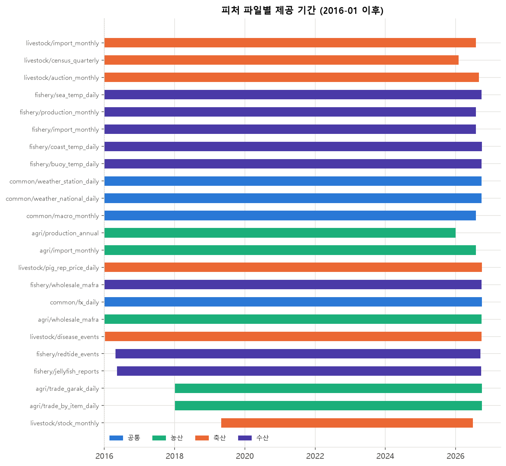
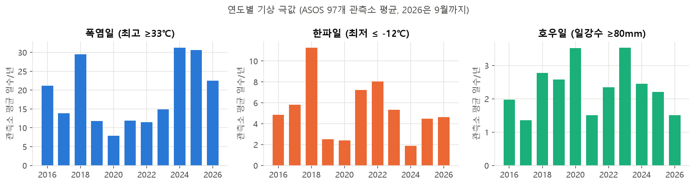
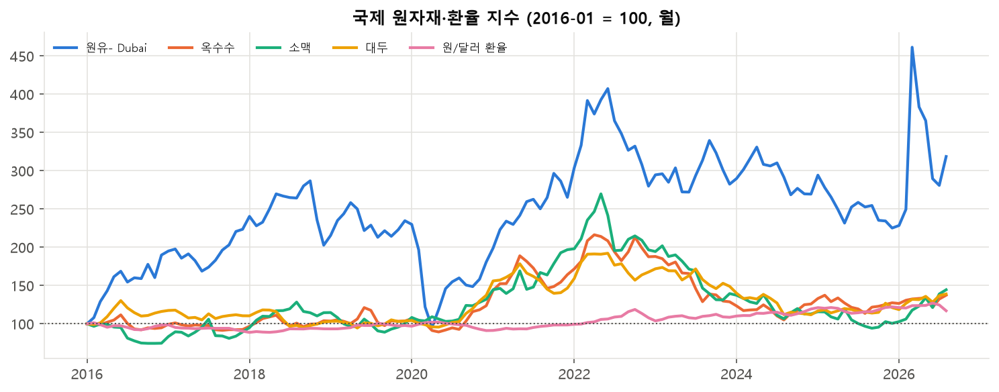
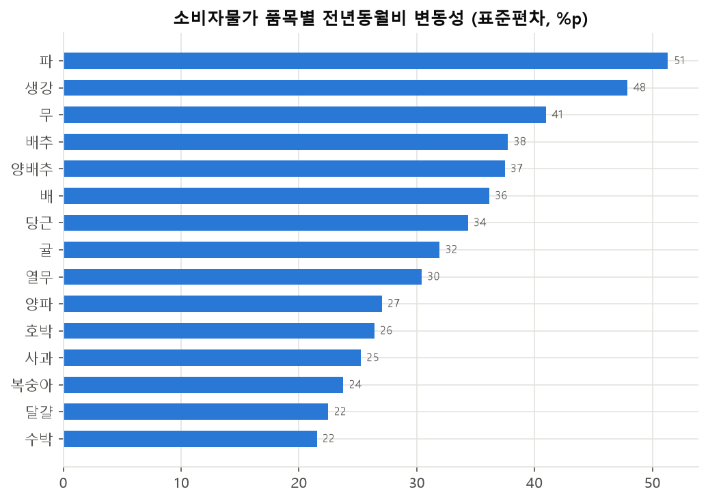
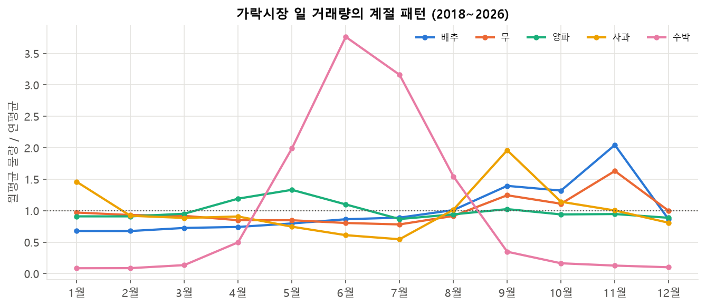
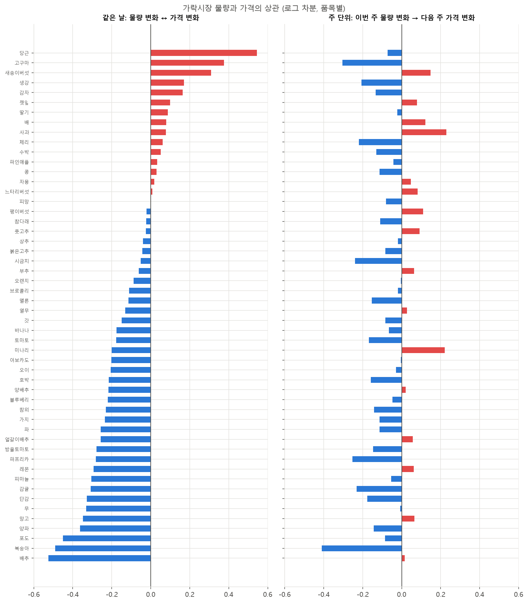
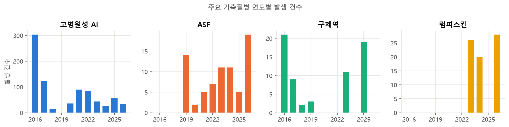
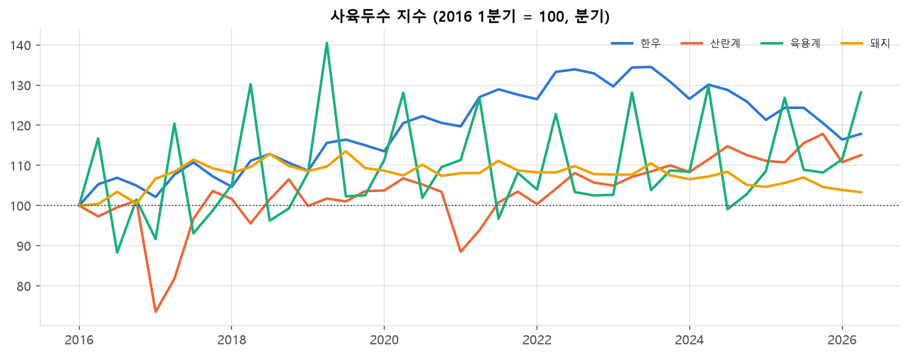
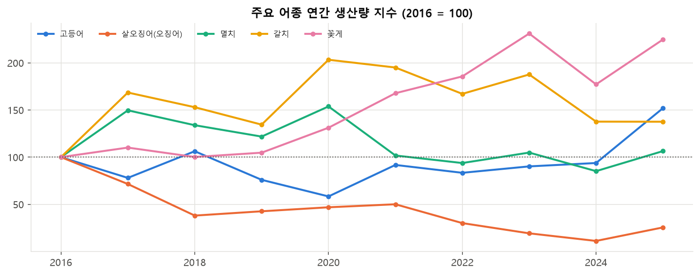
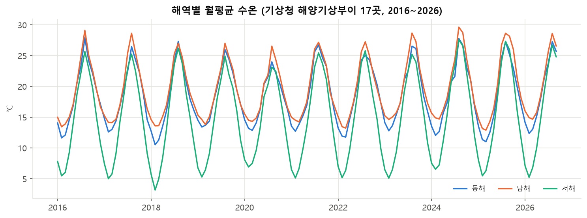

# 피처 EDA (가격 제외)

> 2026-10-01 · 코드: [01_features_eda.py](01_features_eda.py) (`python eda/01_features_eda.py`로 그림 재생성) · 데이터 설명: [docs/processed_data.md](../docs/processed_data.md)
> 가격(타깃) EDA는 수집이 끝난 뒤 별도로 진행한다.

## 요약

| # | 발견 | 피처 설계에 주는 의미 |
|---|---|---|
| 1 | **가락시장 물량은 같은 날 가격과 음의 상관**(중앙값 −0.12, 배추 −0.52, 복숭아 −0.49, 포도 −0.45). 그러나 **이번 주 물량 → 다음 주 가격**은 상관이 약하다(중앙값 −0.06) | 물량은 "현재 가격 수준"을 설명하는 데 강하지만, 미래 예측력은 약하다. 물량의 **추세·누적·평년 대비 편차**로 가공해야 의미가 생길 가능성이 크다 |
| 2 | 물량의 계절성이 품목별로 뚜렷하다: 수박은 6월에 연평균의 3.8배, 배추·무는 11월(김장) 피크, 사과는 9월(추석) 피크 | 월·명절 거리 피처가 필수이고, 품목별로 모델을 따로 두거나 품목 × 월 상호작용이 필요하다 |
| 3 | **소비자물가 변동성 상위는 채소**다(파 51%p, 생강 48, 무 41, 배추 38) | 예측 난이도가 품목마다 크게 다르다. 평가 지표를 품목별로 보고, 채소는 예측 구간을 넓게 잡아야 한다 |
| 4 | 폭염일이 2024·2025년 연속 약 31일(2016~2023 평균 약 15일)이고, 2018년은 폭염과 한파가 모두 극단적이었다 | 기상 극값 **누적 일수**(최근 2~4주 폭염일 등)를 피처로 쓸 만하다. 2018·2024년은 이상치 검증 구간으로 좋다 |
| 5 | 국제 원자재는 2022년 곡물(옥수수·소맥 2배 이상)과 2026년 3월 원유(2016년 대비 4.6배) 급등이 있었고, 환율은 2022년부터 꾸준히 상승(1,161 → 1,463원) | 수입 비중이 큰 품목(수입 소고기·돼지고기, 바나나, 오렌지, 사료를 거치는 축산)에 시차를 둔 원자재·환율 피처를 넣는다 |
| 6 | 고병원성 AI는 2016~17년 겨울에 303건으로 가장 많았고, 이때 **산란계 사육두수가 2017년 1분기에 27% 급감**했다. ASF는 2019년 이후 매년, 럼피스킨은 2023년부터 새로 발생 | 질병 발생 이벤트(최근 N주 발생 건수, 살처분 두수)는 계란·닭·돼지 가격에 직접 연결된다. 2016~17년이 학습에 포함된 것이 중요하다 |
| 7 | **살오징어 생산량이 2016년 대비 11~25% 수준으로 붕괴**했다 (12.2만 톤 → 2024년 1.4만 톤, 2025년 3.1만 톤). 꽃게는 2배 이상 증가 | 수산은 **구조적 추세**가 크다. 월별 어업생산을 추세 피처로 쓰고, 오징어는 수입(HS 0307) 의존도를 같이 봐야 한다 |
| 8 | 연안정지관측 수온은 관측소가 17곳(2016) → 1곳(2026)으로 줄어 쓸 수 없었다. **기상청 해양기상부이로 대체**했다: 2016년부터 운영된 부이 17곳이 2016~2026년 매년 91~100% 관측돼 있다. 2024년은 서해 +1.5℃, 남해 +1.0℃로 가장 따뜻했다 | 해역별 일평균 수온(`fishery/sea_temp_daily.parquet`)을 수산 피처로 쓴다. 평년 대비 편차로 가공한다 |

---

## 1. 데이터 커버리지

- 대부분의 피처가 2016-01부터 2026-08·09까지 이어진다.
- 늦게 시작하는 것: 가락 거래량 2018-01, 축산 재고 2019-05, 적조·해파리 2016년 봄(발생·보고 시즌만 존재).
- 공개 시차: 월 통계(물가·수입·어업생산)는 2026-08, 가축동향은 2026년 2분기, 생산량(연)은 2025년까지. 예측할 때는 **그 시점에 공개돼 있던 값만** 쓰도록 시차를 적용해야 한다.

## 2. 공통 피처

- ASOS 97개 관측소, 기온 결측은 1% 미만이다. `snow_depth`(97% 결측)와 `rain_1h_max`(75%)는 "없음 = 0"의 의미가 섞여 있으니 결측을 0으로 채울지 판단해야 한다. `solar_rad`는 일부 관측소만 측정한다(48% 결측).
- 2026년은 9월까지의 값이다.

- 소비자물가(월)는 가격의 **결과**와 가까워서 타깃 누설 위험이 있다. 피처로 쓴다면 공개 시차(약 1개월)를 반드시 반영하고, 가능하면 식료품 전체·총지수처럼 거시 흐름만 쓴다.

## 3. 농산 피처

- 같은 날의 물량과 가격이 **양의 상관**인 품목(당근 0.54, 고구마 0.38, 새송이버섯 0.31)은 저장성 품목이다. 가격이 오를 때 출하를 늘리는 공급 반응으로 보인다. 반대로 음의 상관이 강한 품목(배추, 복숭아, 포도)은 저장이 어려워 반입량이 곧 가격을 결정한다.
- 매핑 주의: 배추·알배기배추·절임배추는 같은 가락 품목(엽경채류>배추)을 공유해서 물량이 중복된다. 깐마늘(국산)은 피마늘과, 키위는 참다래와 공유한다.
- MAFRA 도매가격: 63개 품목, 16개 시장, 2016-01 ~ 2026-09. aT 중도매 가격과 겹치는 정보가 많으니 **보조·검증용**으로 둔다.
- 수입(관세청): HS 품목명 중 "기타", "사료용"처럼 설명력이 없는 이름이 많다. 품목명이 아니라 **HS 코드 앞자리**(`data/reference/item_map.csv`의 `hs_prefixes`)로 묶어서 써야 한다.

## 4. 축산 피처

- 질병명 표기가 섞여 있어서("고병원성 조류인플루엔자" / "고병원성조류인플루엔자", "가금티프스" / "가금티푸스") `disease_std` 컬럼으로 통일했다.
- 사육두수: 육용계는 분기마다 크게 출렁이는 계절 패턴이 있다(여름 성수기). 돼지는 2017년 통계표가 바뀌는 지점을 이어 붙였다. 2025년 이후 일부 값에 소수점이 있는데, 표본조사 추정치라 오류가 아니다.
- 재고: 소는 kg, 돼지는 ton으로 제공돼서 **ton으로 통일**했다.
- 돈육 대표가격: 박피 가격에 1,500원 미만의 이상 저가가 107건 있다(거래가 적은 날). 쓸 때는 탕박이나 대표가격을 우선한다.
- 경락 권역 코드(CCenter/CCity/CEast/CWest)는 공식 명칭을 확인하지 못했다. 전체(CTot)나 개별 시장 기준으로 쓴다.

## 5. 수산 피처

- 수온: 기상자료개방포털에서 받은 해양기상부이 시간자료를 일평균으로 합쳤다. 해역 평균은 **2016년부터 계속 운영된 17곳만** 써서 부이 추가(17 → 48곳)로 생기는 편향을 막았다. 결측은 해역별로 하루 이하다.
- 연안정지관측(`coast_temp_daily`)은 관측소가 해마다 줄어 피처로 쓰지 않는다.

- 월별 어업생산은 209개 품종으로, 품목 매핑(`kosis_production`)을 통해 가격과 연결할 수 있다.
- 적조는 해마다 17~105건 보고되고 여름에 몰린다. 해파리는 주간보고 제목뿐이라 **보고 건수(주별)** 정도만 피처로 쓸 수 있다.

## 6. 결측·품질 요약

| 파일 | 5% 넘는 결측 | 판단 |
|---|---|---|
| weather_station_daily | rain_1h_max 75%, solar_rad 48%, snow_depth 99% | 적설·1시간 강수는 무강수·무적설 = 0 처리 검토 |
| coast_temp_daily | water_temp 21% | 관측소 감소로 사용 중단 → `sea_temp_daily`(부이)로 대체 |
| census_quarterly | 사육규모별 57% | 사육규모 차원이 없는 통계표(소)라 정상 |
| stock_monthly | 부위 10~12 50% | 돼지에는 없는 부위(소 양지·특수부위·잡육)라 정상 |
| disease_events | end_date 80% | 종식일 미기록. 발생일 기준으로만 사용 |
| redtide_events | density 19% | 발생 여부·건수만 사용 |

## 후속 조치

1. ~~수온 대체~~ → 기상청 해양기상부이로 해결 (2026-10-01).
2. **품목별 주산지 기상**: `asos_station_sido.csv` × KOSIS 시도별 생산량으로 생산량 가중 기상 피처를 만든다.
3. **공개 시차 테이블**: 월·분기 피처마다 "언제 공개되는지"를 정리해서 피처 생성 시 자동으로 밀어 쓰게 한다.
4. 가격 수집이 끝나면 가격 EDA(계절성, 품목 간 상관, 평년 대비 분포)와 위 피처들의 **가격 선행성**(lag별 상관)을 본다.
